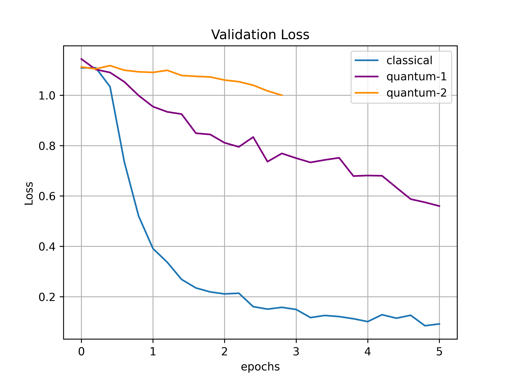
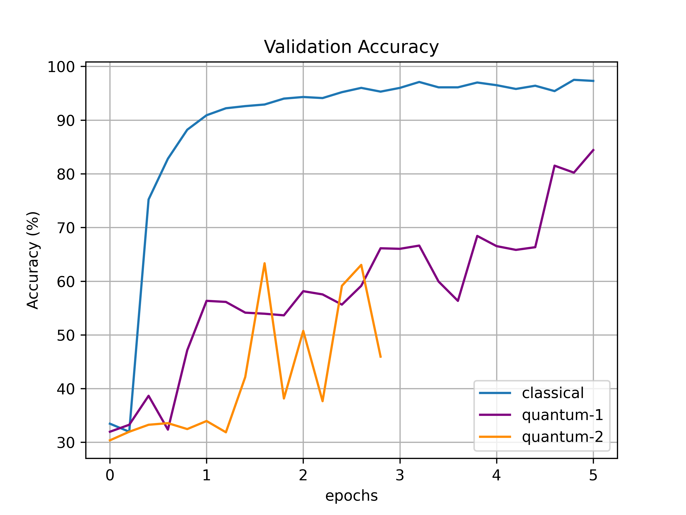
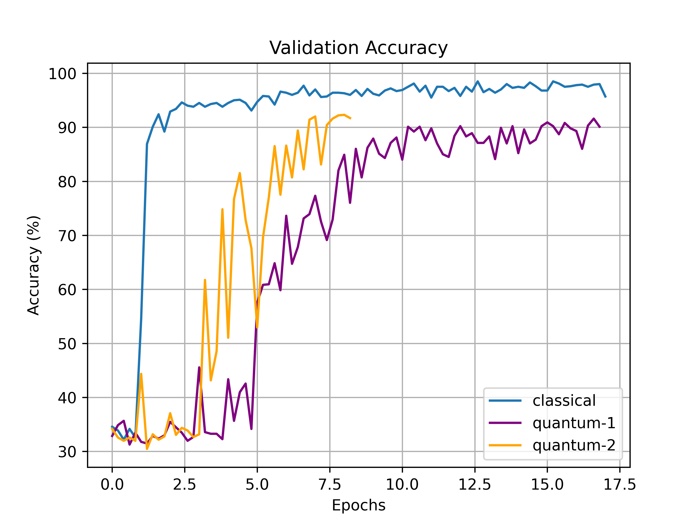

# QuobileNet
A work-in-progress MobileNetV2-based Hybrid Quantum-Classical Object Detector. Currently it modifies a simple, self-made CNN model ([SimpleNet](networks/backbones/SimpleNet.py)) whose classical version achieves an average accuracy of 99.60% on a 3-class classification problem using numbers 0, 6, and 9 from the [MNIST](http://yann.lecun.com/exdb/mnist/) dataset. We replaced one of the 4 convolutional layers with a quantum equivalent: a [quanvolutional layer](networks/backbones/custom_layers/QuanvLayer.py), in order to create [QuanvNet](networks/backbones/QuanvNet.py).

For more information, the results of our current training, and instructions on how to run, please see below.

## Introduction

This project aims to create a hybrid model of popular object detection networks. The primary focus is on [RetinaNet](https://arxiv.org/abs/1708.02002) with a [MobileNet](https://arxiv.org/abs/1704.04861) (and possibly [ResNet-18](https://arxiv.org/abs/1512.03385)) feature extraction backbone. The goal is to introduce quantum layers and measure various performance statistics such as mean Average Precision (mAP) and the number of epochs taken to reach a comparable Loss value.

The main layer focused on is the convolutional layer. Using a modification of both the original quanvolutional layer model introduced in [Henderson et al. (2019)](https://arxiv.org/abs/1904.04767) and the [demo](https://pennylane.ai/qml/demos/tutorial_quanvolution.html) found on PennyLane, a custom-built quantum convolutional layer was built that takes in any kernel size and output layer depth as parameters, automatically determines the correct number of qubits needed, and outputs the appropriate feature map using a quantum circuit as its base and optionally floq as the computational device.

The current plan is to replace key convolutional layers within RetinaNet with the custom-built quanvolutional layer and measure the aforementioned performance statistics. We hope to see improvement within the statistics and hope to extend this project to other popular networks after the QHack 2021 hackathon.

## Current Progress

As an initial step, a [simple Hybrid CNN model](networks/backbones/QuanvNet.py) with 4 convolutional layers was built to perform a 3-class classification task using the MNIST dataset (0, 6, and 9 were chosen as our labels). One of the classical convolutional layers were replaced with with the custom-built [quanvolutional layer](networks/backbones/custom_layers/QuanvLayer.py) and two initial tests were made where `quantum-1` used a Parametrized Quantum Circuit with a depth of 1 and `quantum-2` used the same but with a depth of 2. Although the initial results did not show an initial improvement over the classical method, they carried the potential to achieve better accuracies. The results of these tests can be seen in the **Previous Results** column.

Following the initial tests, our quantum circuit was modified to allow batch sizes greater than one and the codebase was refactored to increase efficiency. In addition, a bug fix was implemented that solved the issue of `quantum-1` outperforming `quantum-2`, even though the opposite was expected on account of the increased Parametrized Quantum Circuit depth increasing the model capacity. The same test was then conducted again, but for a longer period of time, and the results can be seen in the **New Results** column. 

As we can see from the learning curve of `quantum-1`, the model has not reached to a convergence yet and we need to run the model for more epochs. Therefore, we wish to use Floq for the more extensive tests and AWS to test the inference potential of such a hybrid network in NISQ devices.

Previous Results          |  New Results
:-------------------------:|:-------------------------:
  |  

Previous Results          |  New Results
:-------------------------:|:-------------------------:
  |  

## Instructions
### To Run the Hybrid Version of SimpleNet (i.e. QuanvNet)
```
python main.py
```
The above will run the network on your local CPU. The following flags can modify the run:

`--floq_key *YOUR FLOQ API KEY*` will enable the use of Floq if applicable.

`--classic` will switch the backbone to the pure classical version (SimpleNet)

`--gpu` will use your GPUs.

For example, to run our network on the floq device and use GPUs:
```
python main.py --gpu --floq_key *YOUR FLOQ API KEY*
```
### Dependencies
Our codebase works with both `Python==3.7` and `Python==3.8`. In addition, we also use `Pytorch==1.7.1` and `torchvision==0.8.2`. The rest of the dependencies can be installed from the command line via `pip`:
```
pip install -r requirements.txt
```
