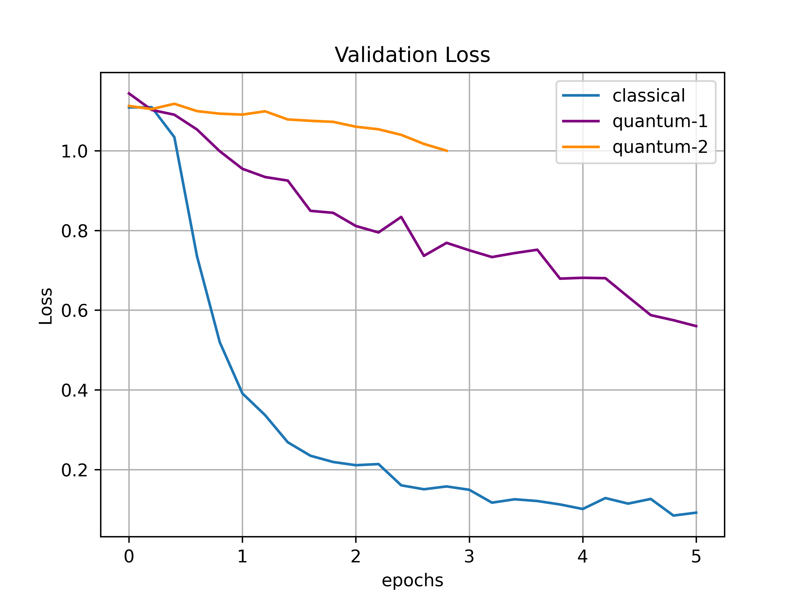
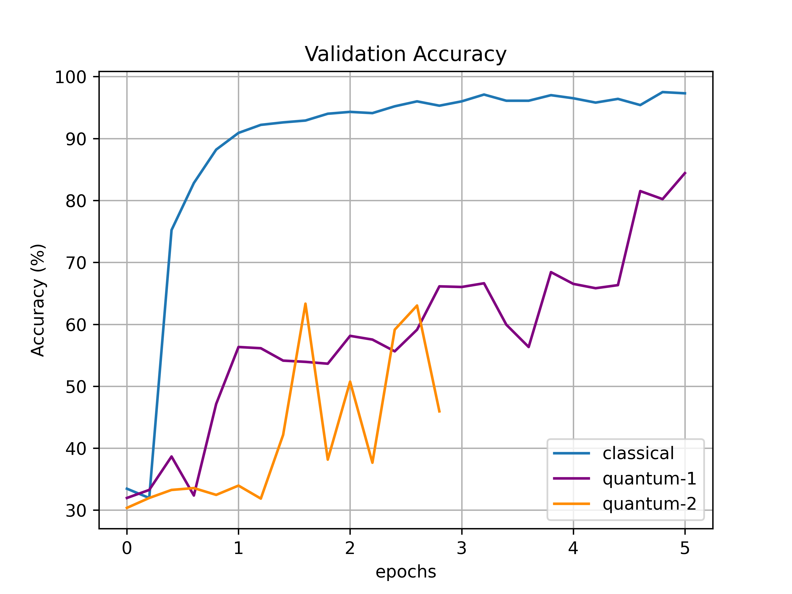

# QuobileNet
A MobileNetV2-based Hybrid Quantum-Classical Object Detector. For instructions on how to run, please see below.

## Introduction

Our project aims to create a hybrid model of popular object detection networks. Primarily, we are focusing on RetinaNet with a MobileNet (and possibly ResNet-18) feature extraction backbone. Our goal is to introduce quantum layers and measure various performance statistics such as mean Average Precision (mAP) and the number of epochs taken to reach a comparable Loss value.

The main layer we are focusing on is the convolutional layer. Using a modification of both the original quanvolutional layer model introduced in Henderson et al. (2019) and the demo found on PennyLane, we custom built a quantum convolutional layer that takes in any kernel size and output layer depth as parameters, automatically determines the correct number of qubits needed, and outputs the appropriate feature map using a quantum circuit as its base.

We plan to replace key convolutional layers within RetinaNet with our custom quanvolutional layer and measure the aforementioned performance statistics. We hope to see improvement within the statistics and hope to extend this project to other popular networks after this Hackathon.

As an initial step, we built a simple Hybrid CNN model with 4 convolutional layers to perform a 3-class classification task using the MNIST dataset (0, 6, and 9 are chosen as our labels). We replaced one of the classical convolution layers with our custom-built Quanvolutional layer and made two initial tests where `quantum-1` uses a Parametrized Quantum Circuit with a depth of 1 and `quantum-2` uses the same but with a depth of 2. Although our initial results do not show an improvement over the classical method, they carry the potential to achieve better accuracies. As we can see from the learning curve of `quantum-1`, the model has not reached to a convergence yet and we need to run the model for more epochs. Therefore, we wish to use Floq for the more extensive tests and AWS to test the inference potential of such a hybrid network in NISQ devices.

<p float="middle">
  
   
</p>

## Instructions
### To Run the Hybrid Version of SimpleNet (i.e. QuanvNet)
```
python main.py
```
The above will run the network on your local CPU. The following flags can modify the run:

`--floq_key *YOUR FLOQ API KEY*` will enable the use of Floq if applicable.

`--classical` will switch the backbone to the pure classical version (SimpleNet)

`--gpu` will use your GPUs.

For example, to run our network on the floq device and use GPUs:
```
python main.py --gpu --floq_key *YOUR FLOQ API KEY*
```
### Dependencies
Our codebase works with both `Python==3.7` and `Python==3.8`. In addition, we also use `Pytorch==1.7.1` and `torchvision==0.8.2`. The rest of the dependencies can be installed from the command line via `pip`:
```
pip install -r requirements.txt
```
