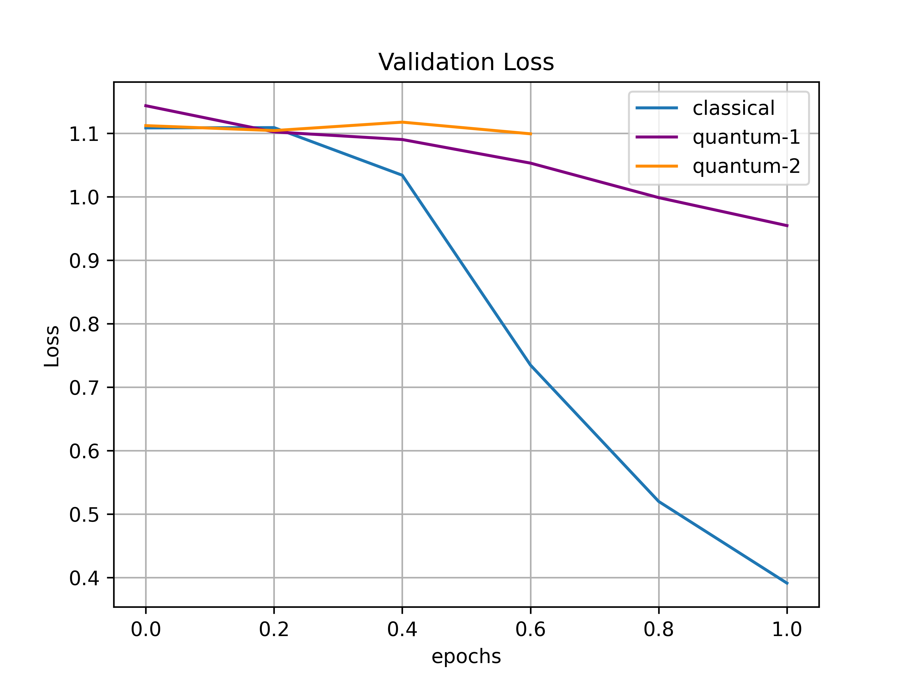
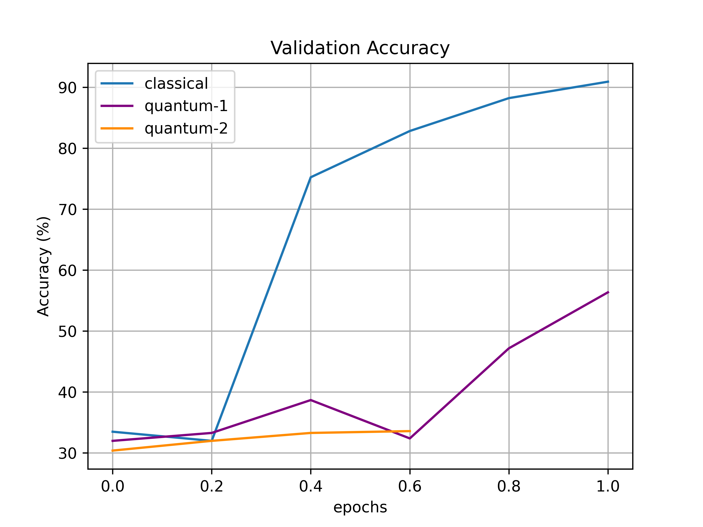

# QuobileNet
MobileNetV2-based Hybrid Quantum-Classical Object Detector

Our project aims to create a hybrid model of popular object detection networks. Primarily, we are focusing on RetinaNet with a MobileNet (and possibly ResNet-18) feature extraction backbone. Our goal is to introduce quantum layers and measure various performance statistics such as mean Average Precision (mAP) and the number of epochs taken to reach a comparable Loss value.

The main layer we are focusing on is the convolutional layer. Using a modification of both the original Quanvolutional layer model introduced in Henderson et al. (2019) and the demo found on PennyLane, we custom built a quantum convolutional layer that takes in any kernel size and output layer depth as parameters, automatically determines the correct number of qubits needed, and outputs the appropriate feature map using a quantum circuit as its base.

We plan to replace key convolutional layers within RetinaNet with our custom quanvolutional layer and measure the aforementioned performance statistics. We hope to see improvement within the statistics and hope to extend this project to other popular networks after this Hackathon.

As a first step we built a Hybrid CNN model to performa a 3-class classification task using the MNSIT dataset (1,6,9 are chosen as our labels). We replaced one of the CNN layers to be Quanvolutional layers and made two initial test where `quantum-1` uses a depth=1 Parametrized Quantum Circuit and `quantum-2` uses depth=2. Although our initial results doesn't show an improvement over the classical method, they carry the potential to achieve better accuracies. As it can be seen from the learning curve of `quantum-1`, the model hasn't reached to a convergence yet and we need to run the model for longer epochs. Therefore, we wish to use the Floq service to the more extensive tests and also the AWS service to test the potential of such a hybrid network in NISQ devices. 

  
   

