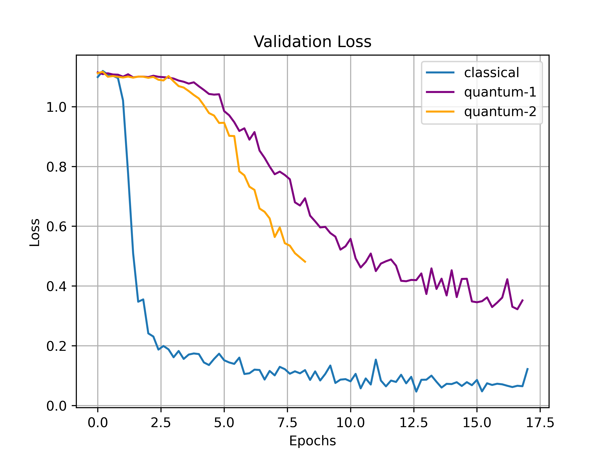

# QuobileNet
A work-in-progress MobileNetV2-based Hybrid Quantum-Classical Object Detector. Currently it modifies a simple, self-made CNN model ([SimpleNet](networks/backbones/SimpleNet.py)) whose classical version achieves an average accuracy of 99.60% on a 3-class classification problem using numbers 0, 6, and 9 from the [MNIST](http://yann.lecun.com/exdb/mnist/) dataset. We replaced one of the 4 convolutional layers with a quantum equivalent: a [quanvolutional layer](networks/backbones/custom_layers/QuanvLayer.py), in order to create [QuanvNet](networks/backbones/QuanvNet.py).

For [instructions](#instructions) on how to run, please see below (or click the hyperlink).

## Introduction

This project aims to create a hybrid model of popular object detection networks. The primary focus is on [RetinaNet](https://arxiv.org/abs/1708.02002) with a [MobileNet](https://arxiv.org/abs/1704.04861) (and possibly [ResNet-18](https://arxiv.org/abs/1512.03385)) feature extraction backbone. The goal is to introduce quantum layers and measure various performance statistics such as mean Average Precision (mAP) and the number of epochs taken to reach a comparable Loss value.

The main layer focused on is the convolutional layer. Using a modification of both the original quanvolutional layer model introduced in [Henderson et al. (2019)](https://arxiv.org/abs/1904.04767) and the [demo](https://pennylane.ai/qml/demos/tutorial_quanvolution.html) found on PennyLane, a custom-built quantum convolutional layer was built that takes in any kernel size and output layer depth as parameters, automatically determines the correct number of qubits needed, and outputs the appropriate feature map using a quantum circuit as its base and optionally floq as the computational device.

The current plan is to replace key convolutional layers within RetinaNet with the custom-built quanvolutional layer and measure the aforementioned performance statistics. We hope to see improvement within the statistics and hope to extend this project to other popular networks after the QHack 2021 hackathon.

## Current Progress

As an initial step, a [simple Hybrid CNN model](networks/backbones/QuanvNet.py) with 4 convolutional layers was built to perform a 3-class classification task using the MNIST dataset (0, 6, and 9 were chosen as our labels). One of the classical convolutional layers was replaced with the custom-built [quanvolutional layer](networks/backbones/custom_layers/QuanvLayer.py) and two initial tests were made where `quantum-1` used a Parametrized Quantum Circuit with a depth of 1 and `quantum-2` used the same but with a depth of 2. Loss and accuracy curves for `quantum-1`, `quantum-2`, and the fully `classical` version were plotted. Although the results did not show an initial improvement over the classical method, they carried the potential to achieve better accuracies. The results of these tests can be seen in the **Previous Results** column.

Following the initial tests, our quantum circuit was modified to allow batch sizes greater than one and the codebase was refactored to increase efficiency. In addition, a bug fix was implemented that solved the issue of `quantum-1` outperforming `quantum-2`, even though the opposite was expected on account of the increased Parametrized Quantum Circuit depth increasing the model capacity. The same test was then conducted again, but for a longer period of time, the results of which can be seen in the **New Results** column.

When comparing the two tests, a stark improvement can be seen in our current quanvolutional layer's performance. The shape of the Loss curve is steeper for both `quantum-1` and `quantum-2`, and around epoch 5, we see a large jump in accuracy for `quantum-1` when compared to the previous results. Both `quantum-1` and `quantum-2` now more closely resemble the performance of `classical`. `quantum-2` is also now outperforming `quantum-1` for almost all the epochs after epoch 2.5. When both are compared to `classical`, `classical` still outperforms the hybrid quantum-classical versions, but both hybrid versions are approaching the scores of `classical`. 

Once again, it can be seen that convergence has not fully occurred and that there is a chance it will occur at the same level of accuracy as it does for `classical` given more epochs.

Previous Results          |  New Results
:-------------------------:|:-------------------------:
  |  

Previous Results          |  New Results
:-------------------------:|:-------------------------:
  |  

## Future Plans

The models will be trained for longer. While it is evident that the hybrid models do not converge nearly as fast as `classical`, it is worth exploring the possibility of whether or not they achieve the same accuracy and loss upon convergence. Once this is done, inference will be conducted on quantum machines via the AWS NISQ devices in order to test our trained models on actual quantum circuits.

Once that is completed, work will begin to simultaneously improve the efficiency of our quanvolutional layer and to try and implement it within more established feature extraction backbones such as MobileNetV2. Currently, our working hybrid version eponymously titled [QuobileNet](networks/backbones/quobilenet.py) takes a large period of time per picture. We plan to modify the hyperparameters (kernel sizes, feature map input and output depth for convolutions, etc) in order to bring the training time down and train the model. Finally, we plan to make comparisons with the established performances of the classic version of MobileNetV2 before using it as a backbone for RetinaNet and evaluating its performance as an object detector.

In the long term, we hope to see improvements in accuracy and model capacity when using hybrid quantum-classical models of neural networks and we hope that our work on the quonvolutional layer brings us one step closer to that goal.

## Instructions
### To Run QuanvNet
```
python main.py
```
The above will run the network on your local CPU. The following flags can modify the run:

`--floq_key *YOUR FLOQ API KEY*` will enable the use of Floq if applicable.

`--classical` will switch the backbone to the pure classical version (SimpleNet)

`--gpu` will use your GPUs.

For example, to run the classical version and use GPUs:
```
python main.py --gpu --classical
```
Or to use Floq:
```
python main.py --gpu --floq_key *YOUR FLOQ API KEY*
```

### Dependencies
Our codebase works with both `Python==3.7` and `Python==3.8`. In addition, we also use `Pytorch==1.7.1` and `torchvision==0.8.2`. The rest of the dependencies can be installed from the command line via `pip`:
```
pip install -r requirements.txt
```
